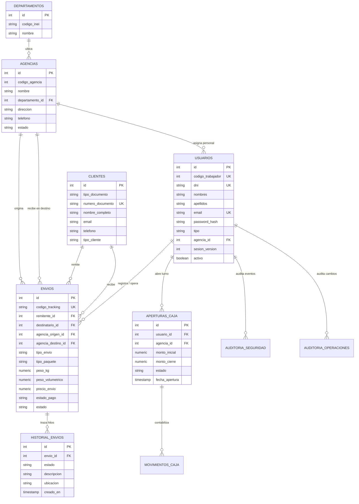

# Arquitectura de Datos y Persistencia Relacional

> **Módulo:** Capa de Base de Datos y Persistencia  
> **Motor Canónico:** PostgreSQL 17 (3NF / Pistas de Auditoría Inmutables)  
> **Motor de Desarrollo Local:** SQLite 3 (`cargaexpress.db`) inicializado con `init_local_db.py`  
> **ORM:** SQLAlchemy 2.0 (Mapped Columns, Type Annotations)  
> **Script DDL Maestro:** [`cargaexpress_clean.sql`](file:///c:/Users/User/Documents/VSC-Integrador/cargaexpress_clean.sql)  
> **Estado:** 🏛️ **ESPECIFICACIÓN OFICIAL DE DATOS**

---

## 1. Visión General del Modelo de Datos

El diseño de datos de **CargaExpress Perú** resuelve los tres retos críticos de una empresa de transporte interprovincial de encomiendas:
1. **Trazabilidad Física Ininterrumpida:** Saber exactamente en qué sucursal, camión o custodio se encuentra una encomienda en cada minuto.
2. **Consistencia Contable y Tributaria:** Garantizar que los importes facturados (Subtotal + IGV = Total) no puedan alterarse sin una Nota de Crédito debidamente vinculada.
3. **Auditoría Forense Inmutable:** Mantener bitácoras de inserción y modificación protegidas contra eliminación accidental o maliciosa.

---

## 2. Diagrama Entidad - Relación (Core ERD)

---

## 3. Catálogo de Entidades Principales

### 3.1. `envios` (Núcleo Operativo y Financiero)
* **Llave Primaria:** `id INTEGER / BIGINT`
* **Código de Negocio:** `codigo_tracking VARCHAR(20)` único e indexado (ej. `CE-2026-00001`).
* **Desglose Tarifario:**
  * `monto_subtotal NUMERIC(10, 2)`: Base imponible.
  * `monto_igv NUMERIC(10, 2)`: Impuesto General a las Ventas (18% en Perú).
  * `precio_envio NUMERIC(10, 2)`: Total exigible al cliente (`subtotal + igv`).
* **Dimensiones Físicas Oficiales:**
  * `peso_kg NUMERIC(8, 2)`: Peso comprobado en balanza física.
  * `largo_cm`, `ancho_cm`, `alto_cm NUMERIC(8, 2)`: Dimensiones físicas del bulto.
  * `peso_volumetrico NUMERIC(8, 2)`: Calculado como `(largo * ancho * alto) / 6000`.
* **Estados Logísticos y de Pago:**
  * `estado`: `registrado`, `recepcionado`, `en_ruta`, `en_agencia_destino`, `en_reparto`, `entregado`, `cancelado`.
  * `estado_pago`: `pendiente`, `pagado`.
  * `lugar_pago`: `origen`, `destino`.

### 3.2. `historial_envios` (Línea de Tiempo Pública y Privada)
* Cada cambio de estado de un envío crea obligatoriamente un registro en esta tabla.
* Almacena: `envio_id`, `estado`, `descripcion`, `ubicacion`, `usuario_id`, `creado_en`.
* Es una tabla de **solo inserción (append-only)**; jamás se ejecuta `UPDATE` o `DELETE` sobre sus registros.

### 3.3. `usuarios` (Personal Operativo y de Gestión)
* Identificado por `dni VARCHAR(8)` único y `codigo_trabajador`.
* Roles autorizados (`tipo`): `administrador`, `cajero`, `supervisor`, `almacen`, `courier`, `transportista`.
* Pertenencia a sede: `agencia_id REFERENCES agencias(id)` (previene BOLA al acotar operaciones a la sucursal del empleado).
* Invalidador de sesiones: `sesion_version INTEGER DEFAULT 1`. Al incrementar este valor, cualquier token emitido con una versión anterior se vuelve inválido en el acto.

### 3.4. `clientes` (Directorio de Personas Naturales y Jurídicas)
* `tipo_documento`: `dni` (8 dígitos), `ruc` (11 dígitos), `ce` (carnet de extranjería), `pas` (pasaporte).
* `numero_documento`: Único a nivel sistema.
* Soporta remitentes frecuentes, corporativos y clientes ocasionales.

### 3.5. `aperturas_caja` y `movimientos_caja` (Control de Flujo de Efectivo)
* **Aperturas de Caja:** Controla turnos de trabajo por cajero y agencia. Registra `monto_inicial`, `monto_cierre_declarado`, `monto_cierre_sistema`, `diferencia` y estado (`abierta`, `cerrada`).
* **Movimientos de Caja:** Registra cada ingreso por cobro de encomienda o egreso autorizado, indexado por turno.

---

## 4. Estrategia de Integridad Referencial y Restricciones (Constraints)

Para blindar la base de datos contra inconsistencias:
1. **`ON DELETE RESTRICT` en Llaves Foráneas Críticas:**
   - No se permite eliminar una agencia si tiene envíos o usuarios asignados.
   - No se permite eliminar un cliente si figura como remitente o destinatario de un envío.
   - No se permite eliminar un usuario si tiene registros de auditoría o envíos operados.
2. **Restricciones `CHECK` a Nivel Motor:**
   - `chk_envios_peso_positivo`: `peso_kg > 0`.
   - `chk_envios_precios_no_negativos`: `precio_envio >= 0 AND monto_subtotal >= 0`.
   - `chk_usuarios_dni_formato`: Longitud exacta de 8 caracteres numéricos para DNI peruano.
3. **Índices de Alto Desempeño:**
   - Índice B-Tree en `codigo_tracking` (búsquedas instantáneas de tracking público y lectura de código de barras).
   - Índice B-Tree en `dni` y `email` de usuarios.
   - Índice B-Tree en `numero_documento` de clientes.
   - Índice compuesto `(agencia_origen_id, estado)` para filtros de almacén y despacho.

---

## 5. Dualidad de Motores: PostgreSQL vs SQLite

El backend está diseñado para operar con transparencia en dos motores mediante SQLAlchemy:

| Característica | PostgreSQL 17 (Canónico / Producción) | SQLite (`cargaexpress.db` Local) |
| :--- | :--- | :--- |
| **Tipo de Llaves BigInt** | `BIGINT GENERATED ALWAYS AS IDENTITY` | `Integer primary_key=True` (autoincrement) |
| **Campos JSON** | `JSONB` nativo con soporte de índices GIN | `JSON` serializado como texto en SQLite |
| **Zona Horaria** | `TIMESTAMP WITH TIME ZONE` | `DateTime` guardado en UTC estándar |
| **Inicialización** | Ejecutar script [`cargaexpress_clean.sql`](file:///c:/Users/User/Documents/VSC-Integrador/cargaexpress_clean.sql) | Ejecutar script [`init_local_db.py`](file:///c:/Users/User/Documents/VSC-Integrador/CargaExpressBackend/init_local_db.py) |
