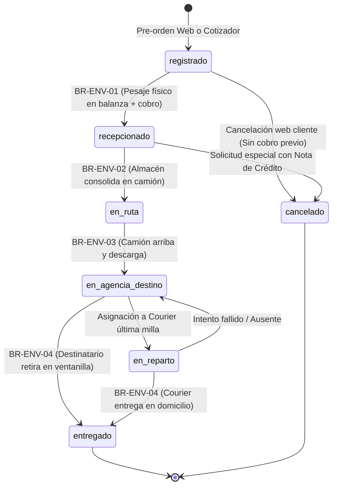

# Reglas de Negocio: Ciclo de Vida del Envío y Matriz de Transición de Estados

> **Módulo:** Dominio Logístico Core  
> **Prefijo de Reglas:** `BR-ENV` (Business Rules - Envíos)  
> **Servicio Responsable:** [`app/services/envio_service.py`](file:///c:/Users/User/Documents/VSC-Integrador/CargaExpressBackend/app/services/envio_service.py)  
> **Controlador API:** [`app/api/v1/endpoints/envios.py`](file:///c:/Users/User/Documents/VSC-Integrador/CargaExpressBackend/app/api/v1/endpoints/envios.py)  
> **Estado:** 📦 **REGLA DE NEGOCIO VIGENTE Y DE OBLIGATORIO CUMPLIMIENTO**

---

## 1. Justificación y Objetivos

El transporte de encomiendas interprovincial exige que cada paquete transite por etapas estrictamente secuenciales. Ningún paquete puede saltarse un control de pesaje, ni figurar como entregado si no ha arribado físicamente a la agencia de destino. 

Estas reglas previenen:
1. **Pérdida o Desvío de Carga:** Control estricto de custodia entre choferes, almaceneros y cajeros.
2. **Fraude en Cobros:** Prohibir el despacho de paquetes no cancelados cuando la modalidad es pago en origen.
3. **Reclamos y Desconocimientos:** Registro obligatorio del documento de identidad del receptor final.

---

## 2. Diagrama de Estados del Ciclo de Vida (State Machine)

---

## 3. Matriz de Transiciones Permitidas y Responsabilidades

| Estado Origen | Estado Destino | Acción de Negocio | Roles Autorizados | Precondiciones Obligatorias |
| :--- | :--- | :--- | :--- | :--- |
| `[*]` | **`registrado`** | Registro de encomienda en portal web o ventanilla. | Cliente Web / Cajero | Datos de remitente, destinatario y agencias válidos. |
| **`registrado`** | **`recepcionado`** | Recepción física en balanza y admisión del paquete. | `CAJERO`, `ALMACEN` | **BR-ENV-01:** Ingreso de peso y dimensiones reales. Pago cancelado si es modalidad origen. |
| **`registrado`** | **`cancelado`** | Desistimiento de orden antes de llevar el bulto a agencia. | Cliente / `CAJERO` | Estado de pago debe ser `pendiente`. |
| **`recepcionado`** | **`en_ruta`** | Carga del bulto al camión de transporte interprovincial. | `ALMACEN`, `TRANSPORTISTA` | **BR-ENV-02:** Debe estar en estado `recepcionado` y con pago acreditado. |
| **`en_ruta`** | **`en_agencia_destino`** | Llegada y descargo del camión en la agencia de la provincia destino. | `ALMACEN`, `SUPERVISOR`, `CAJERO` | **BR-ENV-03:** Debe haber estado en estado `en_ruta`. |
| **`en_agencia_destino`**| **`en_reparto`** | Asignación a chofer de última milla para entrega a domicilio. | `ALMACEN`, `COURIER` | Tipo de envío debe ser `agencia_domicilio` o `domicilio_domicilio`. |
| **`en_agencia_destino`**| **`entregado`** | Entrega personal en ventanilla de la agencia de destino. | `CAJERO` | **BR-ENV-04:** Verificación física de DNI del destinatario y firma de recepción. |
| **`en_reparto`** | **`entregado`** | Entrega física en puerta del domicilio del destinatario. | `COURIER` | **BR-ENV-04:** Verificación de DNI y captura de evidencia de entrega. |

---

## 4. Catálogo Detallado de Reglas de Negocio (BR-ENV)

### `BR-ENV-01`: Obligatoriedad del Pesaje en Balanza Certificada
* **Descripción:** Para que un envío pase de `registrado` a `recepcionado`, es mandatorio ingresar `peso_real_kg`, `largo_real_cm`, `ancho_real_cm` y `alto_real_cm`.
* **Consecuencia:** El sistema ejecuta el recálculo tarifario. Si el cliente pagó menos en la web, el cajero debe cobrar la diferencia física en caja antes de cambiar el estado.
* **Excepción:** No se permite cambiar a `recepcionado` con valores nulos, iguales a cero o negativos.

### `BR-ENV-02`: Bloqueo de Despacho de Carga No Pagada
* **Descripción:** Si un envío tiene `lugar_pago = 'origen'` y `estado_pago = 'pendiente'`, el backend **prohíbe tajantemente** su transición a `en_ruta`.
* **Mensaje de Error:** `"No se puede despachar el paquete CE-XXXXX debido a que tiene un pago pendiente en origen."`
* **Excepción:** Si el envío tiene `lugar_pago = 'destino'` (modalidad contraentrega), sí puede despacharse en ruta con `estado_pago = 'pendiente'`.

### `BR-ENV-03`: Secuencialidad Estricta de Tránsito Interprovincial
* **Descripción:** Un envío solo puede marcarse como `en_agencia_destino` si su estado inmediatamente anterior fue `en_ruta`.
* **Motivación:** Evita que un empleado salte etapas por error operativo o encubra traslados no autorizados.

### `BR-ENV-04`: Protocolo de Entrega y Validación de Identidad
* **Descripción:** Para transicionar al estado `entregado`, el sistema exige:
  1. Que el `estado_pago` sea obligatoriamente `'pagado'` (si era contraentrega, se cobra el saldo antes de entregar el bulto).
  2. Registro del DNI de la persona que retira físicamente el paquete.
  3. Si la persona que retira no es el destinatario registrado, se exige adjuntar número de documento del apoderado autorizado.
  4. Actualización de `fecha_entrega_real = CURRENT_TIMESTAMP`.

### `BR-ENV-05`: Trazabilidad Inmutable en Historial de Envíos
* **Descripción:** Cada vez que un envío cambia de estado, el backend debe insertar un registro en `historial_envios` conteniendo:
  * `envio_id`
  * `estado`
  * `descripcion` (motivo o detalle del hito)
  * `ubicacion` (Nombre o ID de la agencia que procesó el evento)
  * `usuario_id` (ID del empleado que ejecutó la acción)
  * `creado_en` (Timestamp UTC inmutable)
