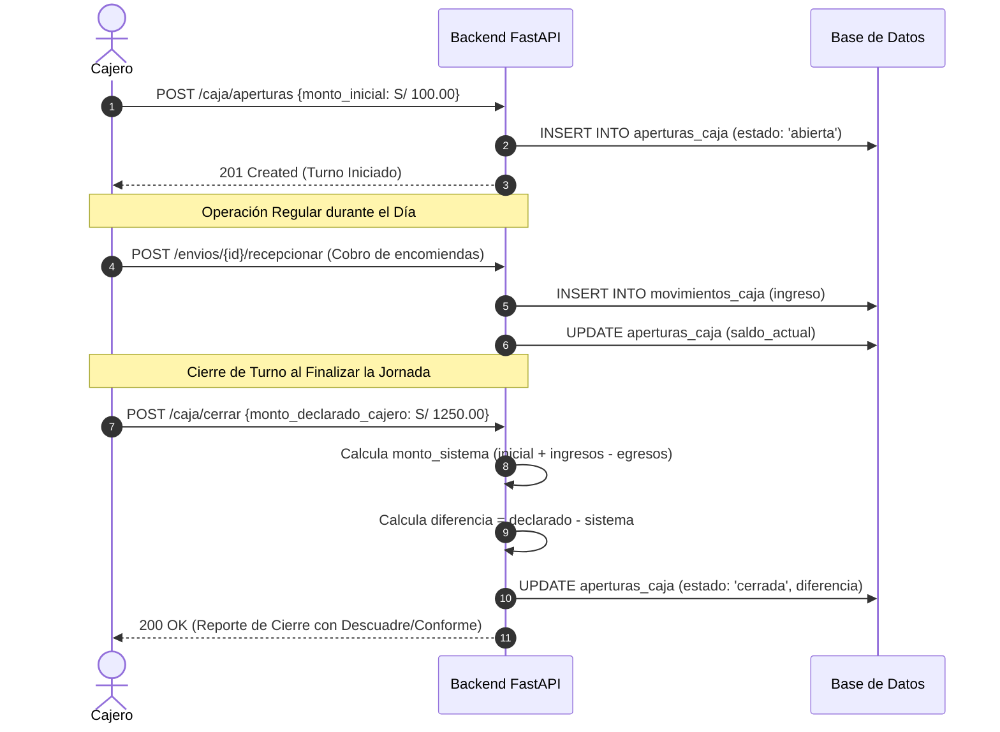

# Reglas de Negocio: Caja Chica, Turnos, Cobranzas y Arqueo

> **Módulo:** Finanzas de Agencia y Control de Efectivo  
> **Prefijo de Reglas:** `BR-CAJ` (Business Rules - Caja)  
> **Servicio Responsable:** [`app/services/envio_service.py`](file:///c:/Users/User/Documents/VSC-Integrador/CargaExpressBackend/app/services/envio_service.py) & Servicios de Caja  
> **Marco Contable:** Plan Contable General Empresarial (PCGE), Reglamento de Comprobantes de Pago (SUNAT)  
> **Estado:** 💵 **REGLA DE NEGOCIO VIGENTE Y DE OBLIGATORIO CUMPLIMIENTO**

---

## 1. Justificación y Objetivos

El manejo de efectivo en ventanilla de agencias físicas es el punto de mayor vulnerabilidad financiera en la operación de encomiendas.

Estas reglas previenen:
1. **Pérdida de Efectivo y Descuadres:** Registro sistemático de cada ingreso de dinero físico en mostrador.
2. **Cobros No Declarados (Jineteo):** Exigir apertura de turno antes de cualquier recepción de paquete.
3. **Fraude en Arqueos:** Aplicar el protocolo de **Arqueo Ciego**, donde el cajero no conoce el monto del sistema hasta declarar su conteo físico.

---

## 2. Flujo de Vida del Turno de Caja

---

## 3. Catálogo Detallado de Reglas de Negocio (BR-CAJ)

### `BR-CAJ-01`: Bloqueo de Cobros sin Turno de Caja Abierto
* **Descripción:** Un cajero no puede recibir paquetes ni cobrar encomiendas si no cuenta con una apertura de caja en estado `'abierta'` en la agencia donde está asignado.
* **Respuesta del Backend:** HTTP 400 Bad Request: `"Debe abrir un turno de caja antes de realizar cobros o recepciones de encomiendas."`

### `BR-CAJ-02`: Métodos de Pago Permitidos en Mostrador
En ventanilla de agencia se aceptan únicamente los siguientes medios de pago auditables:
1. **Efectivo (`efectivo`):** Moneda de curso legal en Soles (`PEN`).
2. **Billetera Digital QR (`yape`, `plin`):** El cajero debe registrar el **número de operación** emitido por la aplicación bancaria.
3. **Tarjeta de Débito/Crédito POS (`tarjeta`):** El cajero ingresa el número de referencia del voucher físico emitido por el POS (Izipay / Niubiz).

### `BR-CAJ-03`: Protocolo de Arqueo Ciego al Cierre
* **Descripción:** Al momento de cerrar caja, la interfaz de usuario **no muestra** el total de dinero recaudado según el sistema.
* **Acción Obligatoria:** El cajero debe contar físicamente los billetes y monedas de su gaveta e ingresar el monto total (`monto_cierre_declarado`).
* **Cálculo Automático en Backend:**
  $$\text{Diferencia} = \text{Monto Declarado} - \text{Monto Calculado por Sistema}$$
* **Tipificación:**
  * $\text{Diferencia} = 0$: **Cierre Conforme (Cuadre Perfecto)**.
  * $\text{Diferencia} > 0$: **Sobrante de Caja** (Queda registrado y pasa a custodia de supervisión).
  * $\text{Diferencia} < 0$: **Faltante de Caja** (Genera reporte de auditoría y se aplica el protocolo de reposición al cajero).

### `BR-CAJ-04`: Correlatividad y Series de Comprobantes Electrónicos
* **Descripción:** Cada agencia tiene asignada una serie fiscal autorizada por SUNAT:
  * Agencias Principales: Boletas `B001`, Facturas `F001`.
  * Agencias Sucursales: Boletas `B002`, `B003`... Facturas `F002`, `F003`...
* **Correlatividad:** Cada comprobante emitido incrementa el correlativo en 1 de forma estrictamente secuencial sin saltos ni duplicados.
* **Inmutabilidad:** Una vez emitido el comprobante, sus importes no pueden alterarse; cualquier anulación exige la emisión de una **Nota de Crédito Electrónica** vinculada según la política de cancelaciones ([01-politicas-cancelaciones-reembolsos.md](file:///c:/Users/User/Documents/VSC-Integrador/CargaExpressBackend/docs/negocio/01-politicas-cancelaciones-reembolsos.md)).
