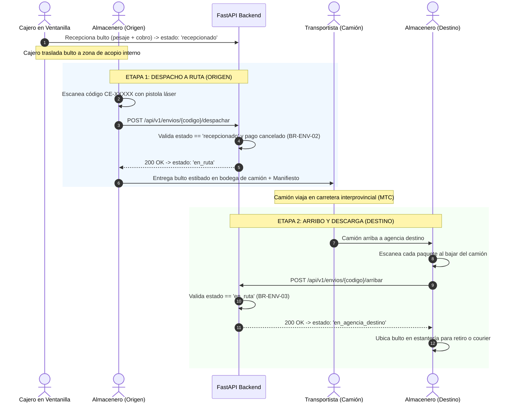

# Flujo de Trabajo Operativo: Rol Almacén (Bodega y Despacho)

> **Rol Asignado:** `ALMACEN`  
> **Área:** Bodega Central y Logística de Carga  
> **Responsable:** Operador de Almacén / Despachador de Carga  
> **Vistas Principales:** [`/admin/almacen/despacho`](file:///c:/Users/User/Documents/VSC-Integrador/CargaExpressFront/src/pages/admin/almacen/AlmacenDespacho.jsx) y [`/admin/almacen/arribos`](file:///c:/Users/User/Documents/VSC-Integrador/CargaExpressFront/src/pages/admin/almacen/AlmacenArribos.jsx)  
> **Estado:** 📦 **GUÍA OPERATIVA Y TÉCNICA VIGENTE**

---

## 1. Misión del Rol en la Operación Logística

El personal de **Almacén** es el custodio físico de las mercancías desde el momento en que son admitidas en ventanilla hasta que abandonan la agencia o son entregadas al destinatario.

### Objetivos Operativos:
1. **Consolidación Segura:** Agrupar bultos recepcionados según su ciudad de destino.
2. **Despacho Eficiente (Salida):** Subir la carga física a los camiones de ruta nacional y formalizar su estado a `en_ruta`.
3. **Recepción Inmediata (Llegada):** Descargar los camiones que llegan de otras provincias, verificar que coincidan con el manifiesto y formalizar su estado a `en_agencia_destino`.
4. **Cero Manipulación Financiera:** El personal de almacén no realiza cobros, no abre cajas ni administra usuarios.

---

## 2. Diagrama del Flujo de Trabajo en Bodega

---

## 3. Procedimientos Paso a Paso

### 3.1. Procedimiento de Despacho a Ruta (Salida de Camión)
1. **Acceso a la Vista:** Ingresar a `/admin/almacen/despacho`.
2. **Escaneo del Paquete:**
   - Ubicar el cursor en el campo de búsqueda rápida.
   - Apuntar la pistola lectora láser al código de barras o código QR de la etiqueta (`CE-2026-NNNNN`).
3. **Verificación en Pantalla:**
   - La pantalla muestra la ficha técnica: Ciudad Destino, Remitente, Destinatario, Peso oficial y Estado.
   - **Condición de Bloqueo (`BR-ENV-02`):** Si el paquete no ha sido pagado y su modalidad es pago en origen, el sistema bloqueará el despacho con advertencia roja.
4. **Confirmación:**
   - Hacer clic en **"Confirmar Despacho a Ruta"** (o presionar `Enter` en el lector).
   - El paquete pasa a estado `en_ruta`.
   - El sistema emite confirmación sonora/visual y limpia el campo automáticamente en 2.5 segundos para continuar con el siguiente paquete de forma continua.

### 3.2. Procedimiento de Arribo de Carga (Llegada de Camión)
1. **Acceso a la Vista:** Ingresar a `/admin/almacen/arribos`.
2. **Descarga y Cotejo:**
   - Al abrir la bodega del camión, el almacenero escanea cada bulto.
3. **Confirmación de Custodia:**
   - El backend valida que el envío se encuentre efectivamente `en_ruta`.
   - Se ejecuta la transición a `en_agencia_destino`.
   - Se inserta un hito inmutable en `historial_envios` con la fecha y hora exacta del arribo y la ubicación de la agencia.
4. **Almacenamiento:**
   - Si el envío es de modalidad **Entrega en Agencia**: se ubica en los casilleros de entrega listos para el cliente.
   - Si el envío es de modalidad **Entrega a Domicilio**: se coloca en la zona de despacho de última milla para entrega al Courier.

---

## 4. Reglas de Negocio Estrictas que Almacén Debe Respetar

* **`BR-ENV-02` (Pago Verificado):** Prohibido despachar paquetes que tengan `estado_pago = 'pendiente'` cuando el lugar de pago sea `'origen'`.
* **`BR-ENV-03` (Secuencialidad de Arribo):** Ningún paquete puede ser marcado como recibido en destino si no estuvo previamente en estado `en_ruta`.
* **Inmutabilidad:** Cada acción de despacho o arribo registra al usuario de almacén responsable en la auditoría inmutable del sistema.
