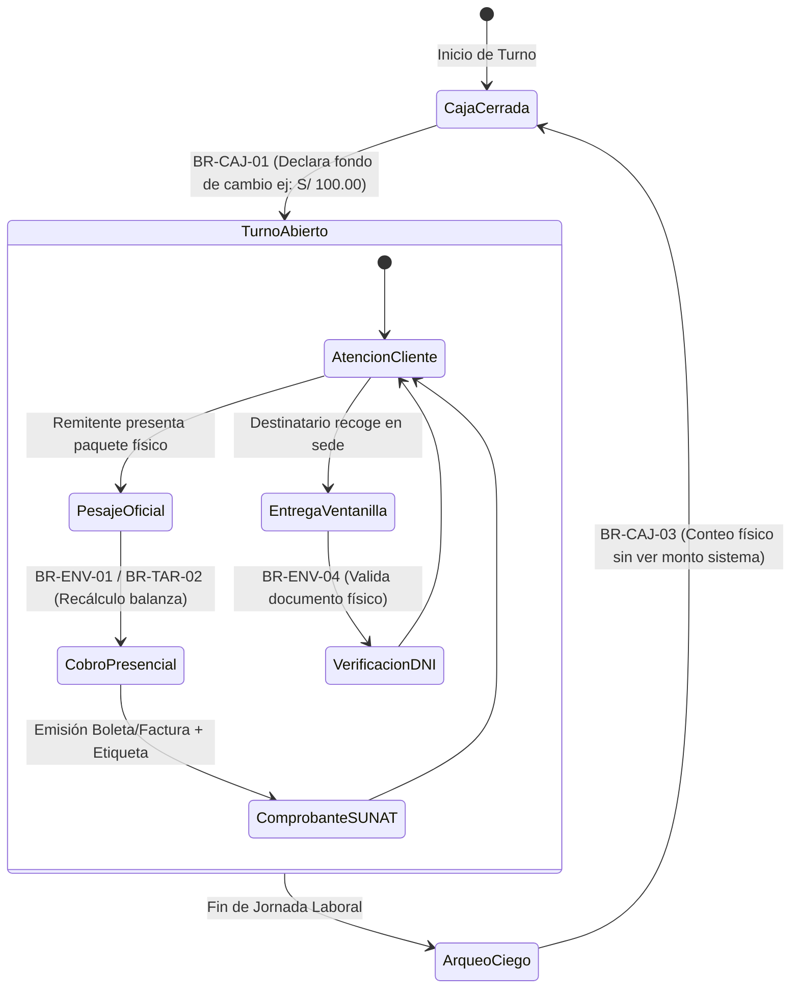

# Flujo de Trabajo Operativo: Rol Cajero (Ventanilla y Caja Chica)

> **Rol Asignado:** `CAJERO`  
> **Área:** Atención al Cliente en Mostrador y Finanzas de Sucursal  
> **Responsable:** Operador de Caja / Representante de Ventanilla  
> **Vistas Principales:** [`/admin/caja/recepcion`](file:///c:/Users/User/Documents/VSC-Integrador/CargaExpressFront/src/pages/admin/caja), [`/registrar-pedido`](file:///c:/Users/User/Documents/VSC-Integrador/CargaExpressFront/src/pages/public/RegistrarPedido.jsx) y [`/admin/caja`](file:///c:/Users/User/Documents/VSC-Integrador/CargaExpressFront/src/pages/admin/caja)  
> **Estado:** 💵 **GUÍA OPERATIVA Y TÉCNICA VIGENTE**

---

## 1. Misión del Rol en la Operación Logística

El **Cajero** es la cara visible de la empresa ante el remitente y destinatario. Tiene bajo su responsabilidad dos pilares críticos:
1. **Inspección Física y Pesaje Oficial:** Medir y pesar en balanza digital certificada cada encomienda admitida.
2. **Custodia y Recaudación Financiera:** Cobrar de forma transparente los fletes mediante efectivo, billeteras digitales (Yape/Plin) o tarjeta, y cuadrar diariamente el dinero recaudado.

---

## 2. Diagrama del Ciclo Diario de Ventanilla

---

## 3. Procedimientos Paso a Paso

### 3.1. Apertura Obligatoria de Turno (`BR-CAJ-01`)
* Al ingresar a la Intranet al inicio de su jornada, el cajero debe dirigirse a `/admin/caja`.
* Si no tiene turno abierto, el sistema **bloquea cualquier cobro o recepción** de paquetes.
* El cajero ingresa el `monto_inicial` recibido para sencillo/vuelto y confirma la apertura.

### 3.2. Admisión y Pesaje Oficial de Encomienda en Ventanilla
1. El cliente presenta su paquete y proporciona el código de tracking (`CE-2026-NNNNN`) o sus datos si es nuevo.
2. El cajero coloca el paquete en la **balanza digital certificada** y mide sus tres dimensiones (Largo, Ancho y Alto en cm).
3. **Recálculo Tarifario (`BR-TAR-02`):**
   - El sistema calcula el peso volumétrico $\frac{L \times A \times H}{6000}$ y toma el mayor frente al peso de balanza.
   - Si el cliente pre-registró un peso menor en la web, el cajero le cobra la diferencia tarifaria en ese instante.
4. **Cobro Presencial:**
   - Si paga en efectivo: Se ingresa el dinero a la gaveta de caja.
   - Si paga con QR (Yape/Plin): El cajero verifica en el celular de la empresa la recepción del abono y registra el número de operación.
   - Si paga con POS: Pasa la tarjeta y anota el número de referencia del voucher.
5. **Cambio de Estado:** El paquete pasa formalmente a `recepcionado` con `estado_pago = 'pagado'`, se imprime la etiqueta con código de barras y se traslada a la zona interna de acopio para Almacén.

### 3.3. Entrega de Paquete en Destino (`BR-ENV-04`)
1. El destinatario acude a la agencia de destino para retirar su encomienda.
2. El cajero busca el código en el sistema.
3. **Condición de Cobro:** Si la encomienda fue enviada en modalidad **Pago en Destino (Contraentrega)**, el cajero debe cobrar el total del flete antes de liberar el paquete.
4. **Validación de Identidad:**
   - El cajero exige la presentación física del DNI del receptor.
   - Si retira un tercero, valida que cuente con carta poder o documento de autorización.
   - El cajero registra el número de DNI de quien retira y confirma la entrega. El paquete transiciona a `entregado`.

### 3.4. Cierre de Turno y Arqueo Ciego (`BR-CAJ-03`)
* Al terminar su turno, el cajero no puede ver cuánto dinero calculó el sistema.
* Realiza el conteo físico de los billetes y monedas en gaveta e ingresa el importe en la pantalla de cierre.
* El backend calcula la diferencia y emite el reporte oficial de cuadre.
